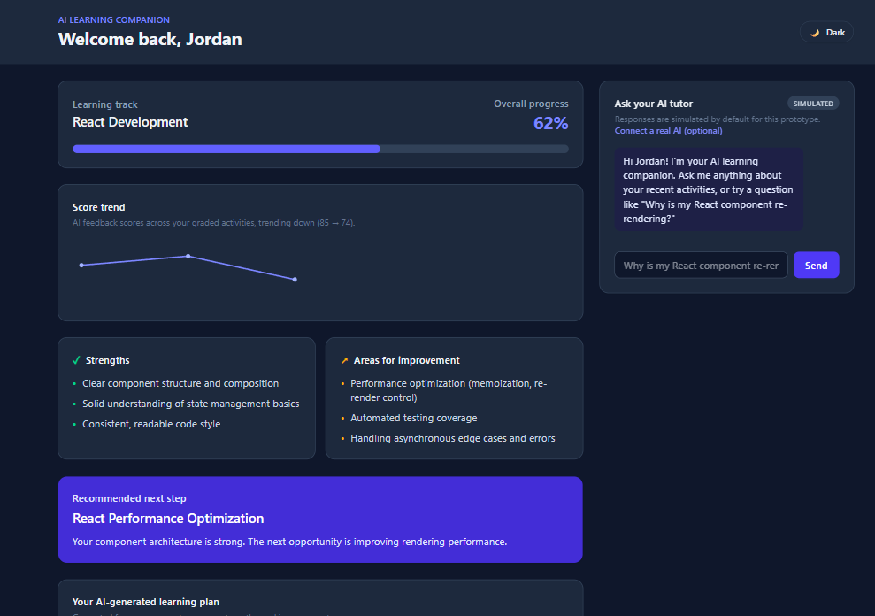

# AI Learning Companion (Illumia Case Study Prototype)

**[Live demo →](https://illumia-one.vercel.app)**

A frontend prototype of an **AI Learning Companion** that helps a learner understand their
progress, strengths, and areas for improvement, and get personalized AI-powered guidance on
what to learn next — built for the Illumia software engineering case study.



## What this is

A single-page React + TypeScript dashboard for a learner working through a "React Development"
track. It shows:

- **Progress overview** — overall completion percentage for the learning track.
- **Score trend** — a small line chart plotting AI feedback scores across graded activities over
  time, so a learner can see whether they're trending up or down at a glance (`src/components/ProgressTrend.tsx`).
- **Strengths & areas for improvement** — a summary generated from the learner's activity history.
- **Recommended next step** — a single, clear "what to do next" recommendation with reasoning.
- **AI-generated learning plan** — a short, ordered list of next steps generated from the
  learner's in-progress work, recommendation, and improvement areas (see
  `src/data/learningPlan.ts`).
- **Activity list** — lessons, coding exercises, and quizzes with completion status. Completed
  items with AI feedback can be expanded to reveal a score, strengths, and suggestions (matching
  the "Evaluate Learner Work" example from the case study).
- **AI tutor chat** — a conversational assistant the learner can ask questions like *"Why is my
  React component re-rendering?"*. Responses are simulated by default, with an optional
  "bring your own OpenAI key" mode for a real LLM-backed conversation (see
  [Live AI tutor (optional)](#live-ai-tutor-optional) below).
- **Dark mode** — a manual light/dark toggle that respects the system preference by default and
  persists the learner's choice.

All data is realistic mock/placeholder data — there is no backend, database, or authentication.

## Approach & design decisions

**Problem framing.** The case study describes four learner needs: understand progress, get
feedback, see improvement areas, and know what to do next. Rather than spreading effort across
many shallow features, I prioritized a single, coherent dashboard that answers all four
questions at a glance, plus one deep, meaningful AI interaction (the tutor chat) rather than
several shallow ones. This matches the brief's emphasis on "rapidly build a polished and
functional prototype" over feature count.

**Why a dashboard + chat, not a wizard or multi-step flow.** Learners returning to a learning
platform want an immediate answer to "where do I stand and what's next," so the landing view
leads with progress and the recommendation, with activity detail and open-ended Q&A available
but not forced.

**Why feedback is inline/expandable rather than a separate page.** The brief explicitly excludes
additional pages. Expanding feedback in place keeps the activity list scannable while still
surfacing the score/strengths/suggestions structure from the "Evaluate Learner Work" example.

**Why a simulated AI tutor by default, with a real LLM as an opt-in.** The brief states a real LLM
integration is optional and mocked responses are acceptable, so the default experience
(`src/data/aiTutor.ts`) is a keyword-matched responder that works with zero setup and mirrors the
tone of the case study's own example answer. For a stronger demo, the chat also supports
connecting a real OpenAI key at runtime (`src/data/liveAi.ts`) — see
[Live AI tutor (optional)](#live-ai-tutor-optional) — while still falling back gracefully to the
simulated responder if no key is provided or the live call fails.

**Why Tailwind CSS v4.** Chosen for fast, consistent, responsive styling without hand-rolled CSS,
keeping the component code focused on structure and behavior.

**Why an AI-generated learning plan in addition to a single recommendation.** The case study lists
"an AI-generated learning plan" as one of several optional AI experiences. A single "next step"
recommendation answers *what's next*, but a short plan (`src/data/learningPlan.ts`) better answers
*what does my next stretch of learning look like*, by sequencing the in-progress activity, the
recommendation, upcoming activities tied to improvement areas, and a reminder to lean on existing
strengths. It's implemented as a small deterministic function (not a real LLM call) so its
reasoning is transparent and unit-testable.

**Why a small automated test suite.** The case study doesn't require production-readiness, but a
focused set of tests (pure-function unit tests for the learning plan generator, plus component
tests for feedback expansion, progress display, and the chat flow) demonstrates the same care I'd
apply to real product code, without over-investing in test infrastructure for a 3-6 hour exercise.

**Why this is deployed live, even though the brief doesn't require it.** A hosted link
([illumia-one.vercel.app](https://illumia-one.vercel.app)) lets a reviewer open the working
prototype in one click, on any device, with zero setup — no cloning the repo, installing Node,
or running `npm install`/`npm run dev` first. It also doubles as a quick sanity check that the
build actually works outside my own machine, not just in local dev.

## Built with AI assistance

In the spirit of the case study's evaluation criteria ("use AI tools while applying your own
judgment"), this prototype was built using GitHub Copilot (Claude) as a pair-programming
assistant. AI tooling was used to:

- Scaffold boilerplate (Vite/React/TypeScript/Tailwind setup)
- Generate component and type code from a design I specified
- Extract and parse the original case study `.docx` into plain text

Product decisions — what to build, what to leave out, how to prioritize the four learner needs,
how AI should show up in the experience, and what assumptions to make — were made deliberately
and are documented above and below, not left to the AI tool's default suggestions.

**Git workflow note.** Commits in this repo go straight to `master` rather than through
feature branches + PRs. That's a deliberate speed/demo trade-off for a solo case-study
prototype, not an oversight — on a live production codebase or a team project, this would
follow standard practice instead: feature branches, PRs with review, and CI checks before
merging.

## Tech stack

- [React 19](https://react.dev/) + [TypeScript](https://www.typescriptlang.org/)
- [Vite](https://vite.dev/) for the dev server and build
- [Tailwind CSS v4](https://tailwindcss.com/) for responsive styling, with a class-based dark mode
- [Vitest](https://vitest.dev/) + [React Testing Library](https://testing-library.com/react) for
  automated tests (30+ tests across components and data/AI logic)

## Live AI tutor (optional)

By default the AI tutor chat uses simulated, keyword-matched responses — no setup or API key
required. To try it with a real model:

1. Open the chat panel and click **"Connect a real AI (optional)"**.
2. Paste an [OpenAI API key](https://platform.openai.com/api-keys) you control.
3. Ask a question — it's sent directly from your browser to OpenAI's Chat Completions API.

Security notes (this is a demo pattern, not a production one):

- The key lives only in component state for the current tab and is **never persisted**
  (no `localStorage`/cookies) and never sent anywhere except OpenAI's API.
- Calling a third-party API directly from the browser means the key is visible in that browser's
  network requests — acceptable for briefly demoing your *own* key, but a real product would
  proxy this call through a backend so the key never reaches the client.
- If the request fails (bad key, network error, timeout), the chat automatically falls back to
  the simulated responder and shows an inline notice rather than breaking the experience.

## Real mode (optional): accounts, persistence, and AI-graded courses

By default this app runs as the **demo prototype** described above: one fixed learner, mock data,
nothing persists. There's also an optional **real mode** that turns it into something you can
actually use for your own learning:

- **Real accounts** — email/password sign-up and sign-in via [Supabase Auth](https://supabase.com/auth).
- **Persisted courses and activities** — stored in a Postgres database with Row Level Security, so
  each learner only ever sees their own data, and progress survives a reload.
- **Multiple, customizable courses** — pick from a few presets (`src/data/coursePresets.ts`: React,
  Python, JavaScript, Data Structures & Algorithms) or build your own by naming a course and
  listing topics.
- **AI-graded activities** — submit an answer/code for any activity and a serverless function
  (`api/grade.ts`) grades it with OpenAI, using a **server-only** API key that never reaches the
  browser (unlike the client-side "bring your own key" tutor chat above).
- **Server-backed AI tutor chat** — once signed in, the tutor chat panel answers with real OpenAI
  responses by default via another serverless function (`api/chat.ts`), using the same server-only
  key. No key needed from the learner; the "bring your own key" panel is still there as an
  alternative. Shared across all users by a global daily cap (see below), since this is a demo, not
  a paid product.

Real mode activates automatically once Supabase is configured; otherwise the app falls back to the
demo experience, so the existing [live demo](https://illumia-one.vercel.app) keeps working
unchanged.

### Setup

1. Create a free project at [supabase.com](https://supabase.com).
2. In the project's SQL Editor, run [`supabase/schema.sql`](supabase/schema.sql) once to create the
   `profiles`, `courses`, and `activities` tables and their RLS policies.
3. Copy `.env.example` to `.env` and fill in your project's **URL** and **anon public key** (Project
   Settings → API). Both are safe to expose client-side — Supabase's Row Level Security, not
   secrecy of this key, is what protects each user's data.
4. For AI grading and tutor chat, set these as **server-only** environment variables (in Vercel's
   dashboard for a deployed app, or a local `.env` read by `vercel dev`) — never commit them or
   paste them into client code:
   - `OPENAI_API_KEY` — your own OpenAI key, used by both `api/grade.ts` and `api/chat.ts`.
   - `VITE_SUPABASE_URL` / `VITE_SUPABASE_ANON_KEY` — same values as step 3 (both serverless
     functions re-validate the caller's session token independently of the browser).
5. Run `npm run dev` (or deploy) — once `VITE_SUPABASE_URL`/`VITE_SUPABASE_ANON_KEY` are present,
   the app boots into real mode and prompts you to sign up.

### Cost controls & abuse prevention

Since AI grading and tutor chat both call OpenAI using a shared server-side key, several layers of
protection keep costs bounded even if the app is left publicly reachable:

- **Per-user rate limiting on grading** — `api/grade.ts` caps each signed-in user at **15 grading
  calls/hour** and **50/day**, enforced server-side via a `grading_events` log table (see
  `supabase/schema.sql`) with its own owner-scoped RLS policy. Requests over the limit get a `429`
  before any OpenAI call is made, so a single account can't drive up spend.
- **Shared global daily limit on tutor chat** — `api/chat.ts` caps the *whole app* at **100
  server-backed chat replies/day** (not per-user, since this is a demo cost cap rather than
  per-account abuse prevention), tracked via a `chat_events` table. Once the shared cap is hit for
  the day, the chat falls back to a simulated response with a notice until it resets.
  Cost-wise, each reply is a small `gpt-4o-mini` call (~500 input tokens of prompt/history +
  up to 200 output tokens), roughly **$0.0002 per chat**. At the full 100/day cap that's about
  **$0.02/day, or under $1/month** even if the limit is hit every single day — well inside the
  $10/month account-wide cap below.
- **OpenAI account-wide spend limit** — a hard monthly budget (with a hard-enforcement toggle, not
  just an alert) is set directly in the OpenAI dashboard at
  [platform.openai.com/settings/organization/limits](https://platform.openai.com/settings/organization/limits).
  Once total spend across *all* keys on the account hits the limit, further API requests fail with
  `429` regardless of what the app's own rate limiting does. This is the backstop against bugs or
  limits being bypassed. Recommended for anyone self-hosting this: set a small limit (e.g. $10/month)
  and enable "Enforce a hard limit".

Both are independent of the client-side "bring your own key" tutor chat (`src/data/liveAi.ts`) —
that feature uses a key the learner supplies themselves in their own browser session, so it can't
run up cost on the app owner's account.

## Getting started

Requires [Node.js](https://nodejs.org/) 18+ and npm.

```bash
npm install
npm run dev
```

Then open the URL printed in the terminal (typically http://localhost:5173/).

To run the automated test suite:

```bash
npm run test
```

To create a production build:

```bash
npm run build
npm run preview
```

## Project structure

```
api/
  grade.ts          Serverless endpoint: AI-grades a submission using a server-only OpenAI key
src/
  components/       UI components (progress, trend chart, calendar, strengths, activities,
                     learning plan, AI tutor chat, auth, course switcher, theme toggle)
  data/
    mockData.ts       Mock learner profile and activity/feedback data (demo mode)
    coursePresets.ts  Starter activity lists for preset courses (real mode)
    deriveInsights.ts Derives strengths/improvements/recommendation from real activity data
    aiTutor.ts        Simulated AI tutor responses (keyword-based, no real LLM call)
    liveAi.ts         Optional "bring your own key" OpenAI integration with graceful fallback
    learningPlan.ts   Generates a personalized learning plan from profile + activity data
  hooks/
    useTheme.ts        Light/dark theme state, persisted to localStorage
    useAuth.ts         Supabase auth session state (real mode)
    useCourseData.ts   Courses/activities data + grading actions (real mode)
  services/
    supabaseClient.ts  Supabase client, only created when configured
    courseService.ts   Supabase CRUD for courses/activities + grading requests
  test/
    setup.ts          Test environment setup (jest-dom matchers, cleanup, jsdom polyfills)
  types/index.ts      Shared TypeScript types
  App.tsx             Demo mode dashboard (mock data)
  RealApp.tsx         Real mode dashboard (Supabase-backed, multi-course, AI-graded)
  main.tsx            Picks App vs. RealApp based on whether Supabase is configured
supabase/
  schema.sql        Postgres schema + Row Level Security policies for real mode
```

Component and data files with matching `*.test.tsx` / `*.test.ts` files alongside them contain
automated tests for that module.

## AI experience

Four AI-powered capabilities are demonstrated, exceeding the case study's "at least one"
requirement:

1. **AI-generated feedback & recommendations** — pre-authored mock feedback (score, strengths,
   suggestions) attached to completed activities, plus a single recommended next activity with a
   reason, shown on the dashboard.
2. **Score trend visualization** — a chart of feedback scores over time (`src/components/ProgressTrend.tsx`),
   giving a visual answer to "am I improving?" alongside the raw numbers.
3. **AI-generated learning plan** — a short, ordered plan (`src/data/learningPlan.ts`) built from
   the learner's in-progress activity, recommendation, upcoming activities, and strengths.
4. **AI tutor chat** — an interactive chat box where the learner can type a question and get a
   response. Simulated by default (`src/data/aiTutor.ts`); optionally backed by a real OpenAI call
   (`src/data/liveAi.ts`) when the learner supplies their own API key.

## Assumptions made

Since the case study intentionally leaves some details open, the following assumptions were made:

- **Single learner, single track.** The prototype shows one learner ("Jordan Lee") progressing
  through a React Development track, rather than supporting multiple users or course tracks.
- **Feedback is pre-generated, not computed live.** AI feedback (scores, strengths, suggestions)
  is attached to activities as mock data rather than generated from actual submitted work, since
  there's no code-execution or grading backend in scope.
- **One recommended next step at a time**, rather than a full ranked list, to keep the "what
  should I do next" decision simple and actionable.
- **AI tutor answers are simulated by default** via keyword matching against a small set of
  canned, topic-relevant responses, so the chat works with zero setup. A real LLM call is
  available as an explicit opt-in (own API key, in-memory only) rather than the default, to keep
  the base prototype dependency-free.
- **No authentication, routing, backend, or persistence of learner data** — all learner/activity
  state is in-memory (React state) and resets on page reload, per the "you do not need to build"
  list in the requirements. (The theme preference is the one intentional exception, persisted via
  `localStorage` purely for UI polish, not learner data.)
- **Single page** — the AI tutor is presented as a panel within the same dashboard page rather
  than a separate page/route, since the brief asks for no additional pages.

## Possible next steps

Given more time, this could be extended with: proxying the live AI tutor chat through a backend so
real API keys never touch the client (the AI-grading endpoint already does this), multi-user
course sharing/leaderboards, and richer progress analytics beyond the calendar/trend chart.

- **Token streaming (SSE):** in a production implementation, `aiService.ts` would consume a
  Server-Sent Events (SSE) `ReadableStream` from a backend API rather than resolving a single
  Promise, rendering AI tutor responses token-by-token in real time instead of all at once.
- **Automatic live progress tracking (explored, not built):** we discussed using screen
  sharing/screen recording (the browser's `getDisplayMedia` API) so the app could automatically
  detect what a learner is working on and for how long, instead of relying on manually marking
  activities complete. We deliberately did not build this for the case study because: (1) it
  requires a real permission prompt every session and only sees whatever tab/window/screen the
  user chooses to share — it cannot observe other apps or tabs, so it's not true "screen
  monitoring"; (2) turning captured video into meaningful activity data needs OCR/computer-vision
  analysis, which is unreliable and a large engineering effort on its own; and (3) it raises real
  privacy concerns for a portfolio prototype (consent, no recording/storage of screen content,
  clear stop controls). A safer, privacy-preserving version of the same idea — an in-app "Study
  Session Tracker" using only Page Visibility/focus and input events (no video, no permissions,
  nothing ever leaves the browser) to build a time-on-activity timeline and idle/active
  breakdown — is a promising future direction we may build next.
