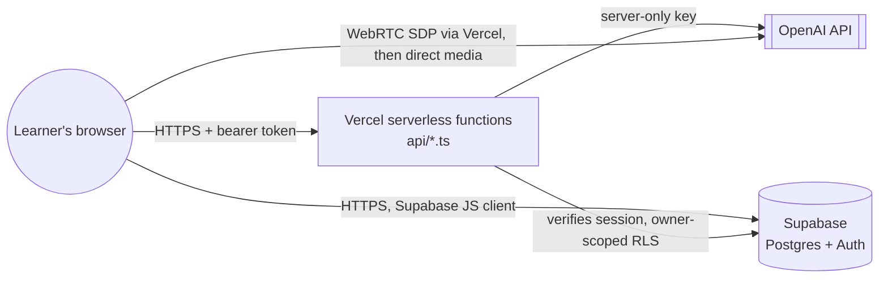

# Architecture

This document describes the current system as built, not the history of how it got here (for
that, see [`housekeeping-and-scope.md`](housekeeping-and-scope.md)). For *why* specific
technologies and approaches were chosen over alternatives, see the [ADR index](adr/README.md).

## System overview



- The **browser** never holds a permanent OpenAI key. It holds a Supabase session token (safe to
  expose; protected by Row Level Security, not secrecy) and, optionally, a learner-supplied "bring
  your own key" used only for the demo-mode fallback chat.
- **Vercel serverless functions** (`api/*.ts`) are the only code that holds the server-only
  `OPENAI_API_KEY`. Every function re-validates the caller's Supabase session token itself: the
  browser is never trusted to say who it is.
- **Supabase** provides authentication and Postgres persistence. Row Level Security (RLS) is the
  actual access-control boundary, enforced at the database layer, not just in application code.
- **OpenAI** is called two ways: normal request/response completions from serverless functions
  (grading, chat, quiz/diagnostic generation, screen observation, session summaries), and a
  Realtime/WebRTC voice session that, after an authenticated SDP handshake through Vercel, streams
  audio directly between the browser and OpenAI.

## Demo mode vs. real mode

The app boots into one of two modes, decided once at startup by whether Supabase environment
variables are present (`src/main.tsx`):

| | Demo mode (`App.tsx`) | Real mode (`RealApp.tsx`) |
|---|---|---|
| Learner data | One fixed mock learner (`src/data/mockData.ts`) | Authenticated Supabase account |
| Persistence | None, resets on reload | Postgres, owner-scoped via RLS |
| AI tutor chat | Simulated keyword responder (`src/data/aiTutor.ts`), optional BYOK | Server-backed OpenAI via `api/chat.ts` |
| Grading/quizzes/diagnostics | Simulated (`src/services/aiService.ts`) | Real OpenAI via `api/grade.ts`, `api/generate-quiz.ts`, `api/generate-diagnostic.ts` |
| Voice tutor / screen observer | Not available | Available, each independently opt-in |
| Setup required | None | Supabase project + `OPENAI_API_KEY` |

This means the required, brief-compliant experience (frontend-only, mocked AI, no setup) is still
the default; real mode is additive and only activates when a reviewer deliberately configures it.

## Request flows

**AI-graded activity submission**
1. Browser calls `api/grade.ts` with the Supabase bearer token and submitted text/code.
2. The function calls `supabase.auth.getUser(token)`: the returned `user.id` is the only source
   of truth for whose request this is.
3. Per-user and shared daily budget checks run before any OpenAI call (see
   [security-and-privacy.md](security-and-privacy.md)).
4. OpenAI grades the submission; the response is sanitized/capped and returned to the browser.
5. Usage is logged to `ai_usage_events` for the shared budget cap.

**Live voice tutor session**
1. Browser creates a local WebRTC offer and calls `api/realtime-session.ts` with the bearer token.
2. The function validates the session, enforces per-user hourly/daily start limits, and calls
   `reserve_realtime_ai_budget()` to atomically reserve $0.75 against the shared daily cap.
3. If reserved, the function forwards the SDP offer to OpenAI's Realtime API with the server-only
   key and returns OpenAI's SDP answer plus a server-generated session ID.
4. Audio then flows directly between the browser and OpenAI over WebRTC; Vercel is no longer in
   the media path after the handshake.
5. The browser reports cumulative token usage from each `response.done` event to
   `api/realtime-usage.ts`, which reconciles actual modality costs and returns whether the session
   may continue; the browser polls this every 5 seconds and stops the session if not.

**Screen learning observer**
1. With explicit consent, the browser captures the shared screen locally (`getDisplayMedia`).
2. A reduced, changed frame is sampled periodically and sent to `api/observe-screen.ts`, which
   returns a sanitized observation (summary, visible action, evidence, optional suggested
   activity/progress update).
3. Any suggested progress update requires explicit learner confirmation before it is applied:
   nothing is written automatically from screen content.
4. If the learner also opts into the voice bridge, the latest sampled frame and sanitized text are
   sent directly into the active Realtime session as an `input_image`/`input_text` message; the
   full video stream is never sent to OpenAI or stored server-side unless the learner separately
   chooses to upload the recording to their private learning diary.

## Trust boundaries

- **Browser ↔ Vercel:** bearer-token authenticated; Vercel never trusts a client-supplied user ID.
- **Vercel ↔ Supabase:** uses the anon key plus the caller's own JWT so RLS still applies;
  the `service_role` key is never used anywhere in this codebase.
- **Vercel ↔ OpenAI:** server-only secret key; never sent to or readable from the browser.
- **Browser ↔ OpenAI (Realtime/WebRTC only):** the browser only ever holds a short-lived SDP
  answer/session, never the permanent API key. See
  [ADR-0004](adr/0004-webrtc-openai-realtime-for-voice.md).

## Tech stack

- [React 19](https://react.dev/) + [TypeScript](https://www.typescriptlang.org/)
- [Vite](https://vite.dev/) for the dev server and build
- [Tailwind CSS v4](https://tailwindcss.com/) for responsive, mobile-first styling
- [Supabase](https://supabase.com/) for auth and Postgres persistence with RLS
- [Vercel](https://vercel.com/) serverless functions as the AI/API boundary
- [Vitest](https://vitest.dev/) + [React Testing Library](https://testing-library.com/react)
- [`@mediapipe/tasks-vision`](https://www.npmjs.com/package/@mediapipe/tasks-vision) for local-only
  face-presence detection

## Project structure

```
api/
  grade.ts                AI-grades a submission (server-only OpenAI key)
  chat.ts                 Server-backed AI tutor chat replies (shared daily cap)
  generate-quiz.ts        Generates live, course-scoped quiz questions
  generate-diagnostic.ts  Generates one prerequisite question per course topic
  observe-screen.ts       Produces sanitized observations from consented sampled frames
  save-session-summary.ts Persists a summary/timeline to the learning diary
  realtime-session.ts     Authenticated OpenAI Realtime WebRTC SDP negotiation + budget reservation
  realtime-usage.ts       Reconciles Realtime token usage and reports remaining budget
  _aiBudget.ts            Shared cost-estimation and budget-check helpers (not a route)
src/
  components/   UI: progress, trend chart, activity calendar, strengths, activity list/cards,
                quiz runner, learning plan, AI tutor chat, auth, course switcher, theme toggle,
                live voice tutor, screen share monitor, face-presence monitor
  context/      Study session tracking and screen-observation sharing across panels
  data/         Mock data, simulated AI, learning plan generation, mastery/spaced-review logic,
                course presets, BYOK client-side OpenAI integration
  hooks/        Theme, auth session, course data, Realtime voice lifecycle, demo-mode state
  services/     Supabase client, course CRUD/grading requests, simulated AI feedback logic
  utils/        Small formatting helpers (e.g. duration formatting)
  types/        Shared TypeScript types, including the Supabase schema shape
  App.tsx       Demo mode dashboard (mock data)
  RealApp.tsx   Real mode dashboard (Supabase-backed, multi-course, AI-graded)
  main.tsx      Picks App vs. RealApp based on whether Supabase is configured
supabase/
  schema.sql    Postgres schema + Row Level Security policies + budget/rate-limit functions
```

Component and data files with matching `*.test.tsx`/`*.test.ts` files alongside them contain
automated tests for that module.
